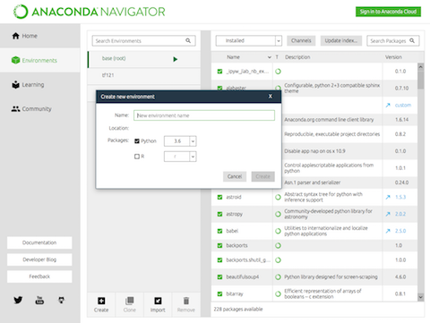

# 形態素解析

Pythonを使って日本語処理をします。
例えば、「すもももももももものうち」という文字列は「すもも」も「もも」も「もも」の「うち」と区切ることで意味が理解できます。  
このように意味がわかる最小単位にすることを形態素解析といいます。

Wikipediaによると、形態素解析（けいたいそかいせき、Morphological Analysis）とは、文法的な情報の注記の無い自然言語のテキストデータ（文）から、対象言語の文法や、辞書と呼ばれる単語の品詞等の情報にもとづき、形態素（Morpheme, おおまかにいえば、言語で意味を持つ最小単位）の列に分割し、それぞれの形態素の品詞等を判別する作業です。

## 環境構築
すでにAnacondaがインストールされていること

### Pythonの仮想環境とは
Python を使って開発や実験を行うときは、用途に応じて専用の実行環境を作成し、切り替えて使用するのが一般的です。こういった、一時的に作成する実行環境を、「仮想環境」 と言います。

### 仮想環境を使用する例
* システム全体で使うPython環境に影響を与えずにモジュールの追加・入れ替えをしたい。
* 同じモジュールの、複数のバージョンを使い分けたい。例えば、開発中のWebアプリケーション開発では、Webアプリケーションフレームワークとして Django の 1.10 を使い、新しいプロジェクトではバージョン 1.11 を使用したい場合など、簡単に切り替えられるようにしたい。
* 異なるバージョンの Python を使いたい。Python2 でしか利用できない、古いモジュールやアプリケーションを使用する場合、Python3.x と Python2.x を切り替えたい。

### AnacondaでのPythonの仮想環境の作成
1. Anaconda Navigatorを開いて、ナビゲーターの左側にある「Environments」メニューを選択します。
2. 下の「Create」ボタンをクリックして、新規環境作成BOXが出てきますので、Name欄にわかりやすい環境の名前をつけてCreateボタンをクリックします。  
  
新規で仮想環境を作成したら、その新規環境が選択された状態になっています。右画面に表示されているものは導入されているパッケージが表示されています。

次にHomeに戻りjupyterのところにあるinstallボタンをクリックしてこの仮想環境にjupyterをinstallしておきます。

## 主な形態素解析ツール

* MeCab
* Janome
* KAKASI
* Chasen

今回はJanomeを使用します。

## Janomeで形態素解析

[Janome](http://mocobeta.github.io/janome/)


## Janomeのインストール
**次の方法で仮想環境を作る場合、pyenvでanacondaをインストールした場合は失敗します。通常のインストールをした場合は問題なく行えます。**

左側にあるEnvironmentsメニューを選択して「morfh」メニューの矢印をクリックしてプルダウンメニューを開きます。
Open terminalを選択するとターミナルが開きます。
次のコマンドを入力します。

```
pip install janome
```

Homeに戻ってjupyterを開きます。

***pyenvでインストールしてJanomeがインストールできない場合は次の設定を行います。***

次の記述を`.bash_profile`に行います。
つまりpyenvを使用しない設定です。
はっきり言ってpyenvでインストールする意味が無くなります。
参考：[pyenvとanacondaを共存させる時のactivate衝突問題の回避策3種類](https://qiita.com/y__sama/items/f732bb7bec2bff355b69)

```
export PATH="$PYENV_ROOT/versions/anaconda3-2.5.0/bin/:$PATH
```

## 簡単な例でjanomeを試す

`first_janome.ipynb`ファイル

janomeのtokenizerを読み込む

```
from janome.tokenizer import Tokenizer
```

読み込ませたい文字列を`tokenize`関数で読み込む

```
malist = t.tokenize("すももももももももものうち")
```

分解する

```
for n in malist:
    print(n)
```

たったこれだけで、単語に分解してくれる。

## 青空文庫から小説をダウンロードして単語の出現頻度を調べる

`wordcount.ipynb`ファイル

JanomeのTokenizerのimportや青空文庫のzipファイル解凍に必要なzipfileをimportします。
さらに、ファイル保存やダウンロードに必要なライブラリをimportしておきます。  
urllib.request / urlopen() はWebスクレイピングする際に必要なライブラリです。

```
from janome.tokenizer import Tokenizer
import zipfile
import os.path, urllib.request as request
```
[青空文庫:我輩は猫である](https://www.aozora.gr.jp/cards/000148/card789.html#download)

今回は夏目漱石の「我輩は猫である」を使います。

ここからは、Pythonで青空文庫からダウンロードする方法です。

青空文庫で「我輩は猫である」を探し、ダウンロードファイルをコピーしてきてから変数に代入します。

```
url = "https://www.aozora.gr.jp/cards/000148/files/789_ruby_5639.zip"
```

次のコードはもし、プロジェクトフォルダに対象のファイルがなければダウンロードする内容です。
Pythonでダウンロードする関数は`request.urlretrieve(url,localfile)`です。

```
localfile = "462_ruby_716.zip"

if not os.path.exists(localfile):
    print("ファイルをダウンロードします")
    request.urlretrieve(url,localfile)
```

これで「我輩は猫である」ファイルをダウンロードできます。

zipファイルの中のファイルを読み取り専用で読み込みます。

```
zipfile = zipfile.ZipFile(localfile, 'r')
```

次のファイルを開きます。

```
file = zipfile.open('wagahaiwa_nekodearu.txt', 'r')
```

こうすることで、zipファイルを解凍することなくその中のファイルの内容を読み込みます。その後変数に代入した上でtextデータに変換します。

```
bindata = file.read()

textdata = bindata.decode('shift_jis')
```

`split`関数で改行コードでデータを分割します。

```
lines = textdata.split("\r\n")
```

for in 文で1行ごとに形態素分析を行う。この処理は少し時間がかかります。

```
for line in lines:
    malist = t.tokenize(line) #形態素のリスト
    for w in malist: # リストの各要素を取り出してカウント
        word = w.surface
        part = w.part_of_speech
        if part.find('名詞') < 0: continue
        if not word in worddic:
            worddic[word] = 0 #数を格納するカウンター用の変数を生成
        worddic[word] += 1  # カウンターを増やす
```

表示はソートを行なった上で実施

```
keys = sorted(worddic.items(),key = lambda x:x[1], reverse=True)
for word,cnt in keys[:50]:
    print("{0}({1})\n".format(word,cnt), end="")
```

「我輩は猫である」に出現する単語は「主人」が934回で「猫」は249回であることがわかる。ちなみに「寒月」の方が「迷亭」より多く出現しているのもわかった。


